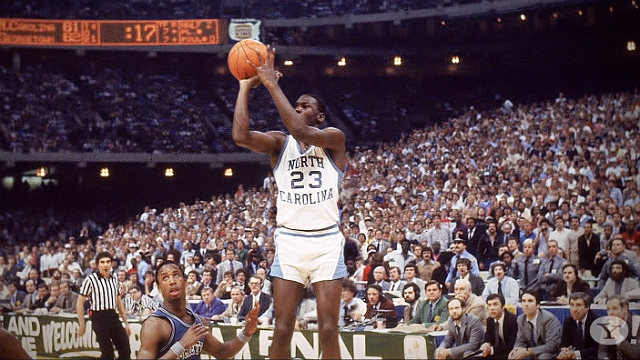
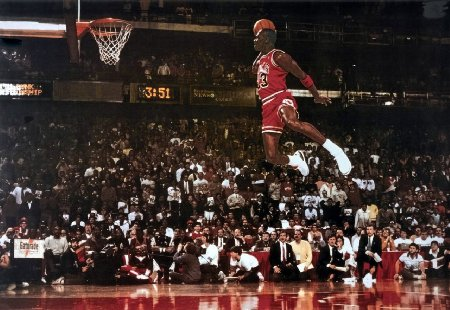
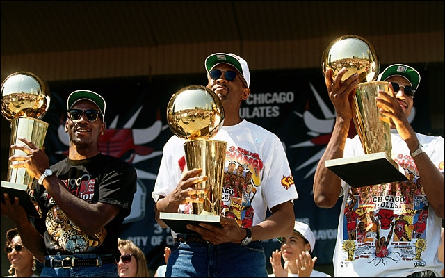

# A Tribute to Michael "Air" Jordan

Navigation:

- [Origins](Origins)
- Early Career
- 3 x Champs
- WhiteSox
- 6 x Champs
- Wizards
- Trophies

> "I can accept failure, but I can't accept not trying."

## Origins

Born February 17, 1963

In 1979, as a sophomore in high school, he was cut from the varsity team

As a freshman at UNC he was ACC Freshman of the Year and hit the game winning shot in the 1982 NCAA Championship game

NCAA First Team All-American his sophomore & junior years and Naismith & Wooden College player of the year in 1984

## Early Career

He skipped his senior year to enter the 1984 NBA Draft where he was selected 3rd by the Chicago Bulls

During his rookie season he was voted an All-Star starter and Rookie of the Year

After missing most of his second season he returned for the playoffs where he set the record for most points in a playoff game with 63

Despite winning numerous awards he struggled to win an NBA chamionship because of the Celtics and especially the Pistons

## 3 x Champs (2 columns)

In the 1990-91 season Jordan and the Bulls defeated the reigning champion Detroit Pistons in the playoffs

The Bulls would go gone to defeat the LA Lakers for their first NBA Championship

Jordan and the Bulls would repeat as champions the following season defeating the Portland Trail Blazers in the finals

In the 1992-93 season Jordan and the Bulls would defeat the Phoenix Suns for a third consecutive championship

## WhiteSox

In July of '93 Jordan's father was murdered. He announced his retirement that October claiming he had lost desire for the game

In February of '94 he signed a minor league baseball contract with the Chicago White Sox

March of '95 Jordan decided to quit baseball and returned to the NBA due to the ongoing MLB strike

## 6 x Champs

He returned at the end of the '95 season wearing the number 45 since 23 had been retired but would eventually swich back to the 23

The '95-'96 season the Bulls would win the championship on Father's Day which turned into an emotional celebration for Jordan

The following year the Bulls would finish the regular season 69-13 before winning their second consecutive championship

In the '97-'98 season the Bulls and Jordan would win the championship again for their second three-peat

Following their second three-peat Jordan would retire again

## Wizards

In 2000 Jordan returned to the NBA but as part owner and President of Basketball Operations for the Washington Wizards

The following year in September of 2001 he announced his return as player for the Wizards

Jordan would play two seasons with the Wizards before finally retiring for the third time

## Trophies

Michael Jordan is one of the greatest players if not the greatest player of all time (depends who you ask)

Besides being a 6 time NBA Champion he also has numerous other awards including 2 Olympic gold medals

On and off the court he is one of the biggest competitors at anything he does

Since his third retirement he has become part owner of the Charlotte Bobcats/Hornets
